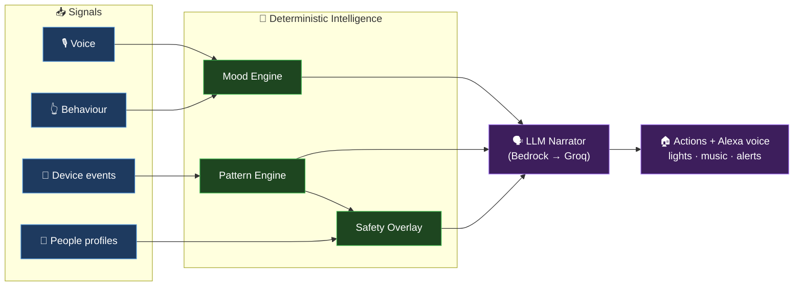
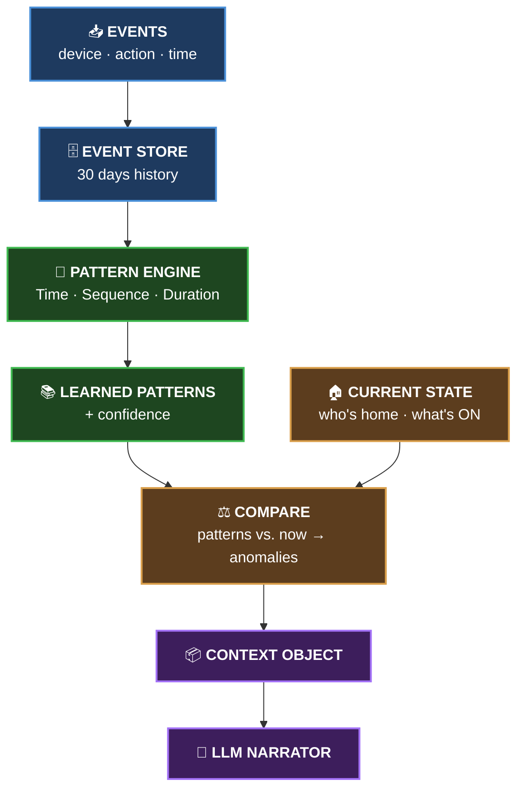
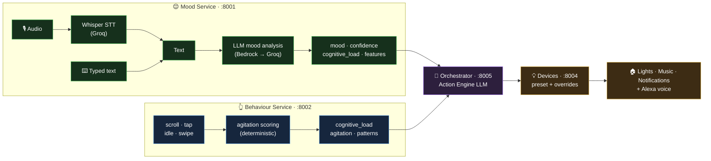
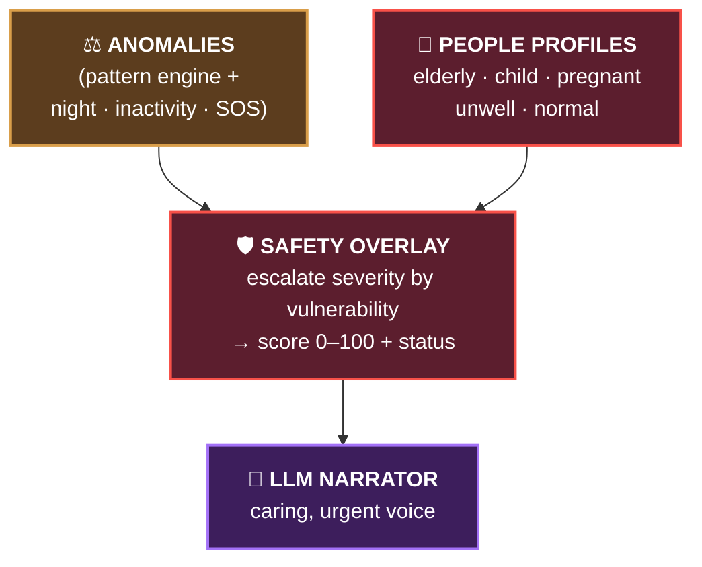
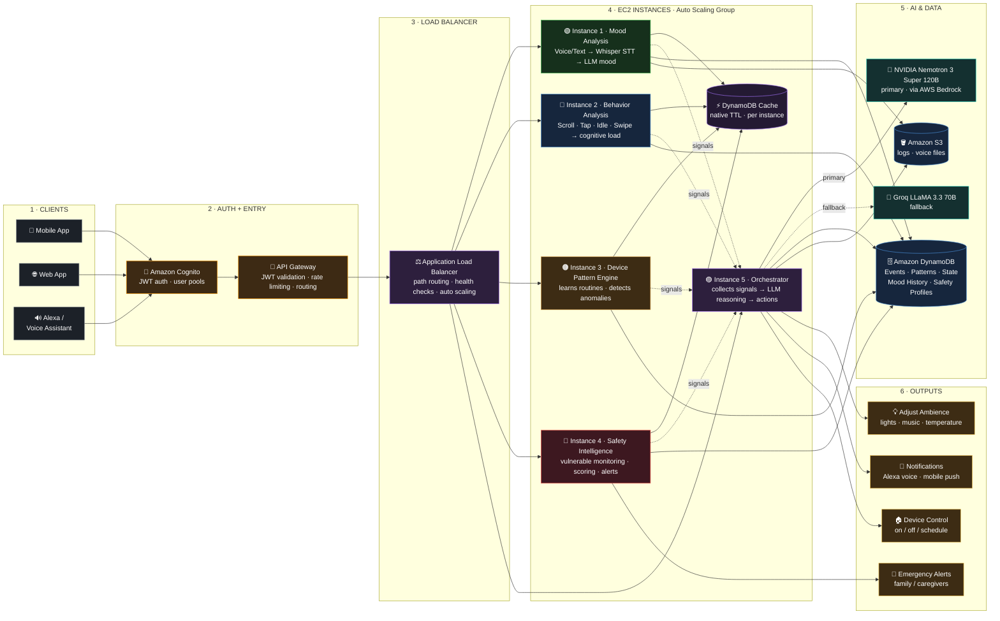
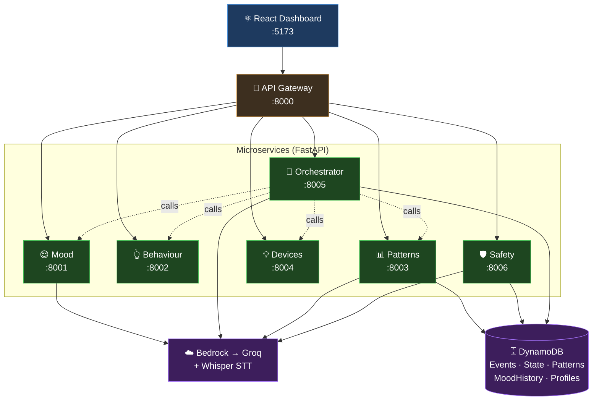

<div align="center">

# 🏠 Awaas AI

### A context-aware smart-home brain that understands how you **feel**, learns how you **live**, and protects who you **love**.

*Built for the Indian household — connected to Amazon Alexa, powered by deterministic intelligence and LLM reasoning.*

<br/>


</div>

---

## 📑 Table of Contents

1. [🏠 Problem & Solution](#-problem--solution)
2. [⭐ Core Features](#-core-features)
3. [🌍 Real-World Scenarios](#-real-world-scenarios)
4. [⚙️ How It Works](#️-how-it-works)
5. [📊 Pattern Recognition Engine](#-pattern-recognition-engine)
6. [� Mood & Cognitive-Load Engine](#-mood--cognitive-load-engine)
7. [🛡️ Adaptive Safety Intelligence](#️-adaptive-safety-intelligence)
8. [🏛️ Architecture](#️-architecture)
9. [🧰 Tech Stack](#-tech-stack)
10. [🚀 Setup](#-setup)
11. [📚 Further Reading](#-further-reading)

---

## 🏠 Problem & Solution

### The Problem

A "smart home" today is just a collection of connected devices controlled through an app. It follows commands, but it doesn't truly understand what's happening inside the home.

It doesn't realize when:

* 😟 You come home after a stressful day and the bright white lights make the environment even more uncomfortable.
* 🔥 The gas stove has been running for 45 minutes when it normally runs for only 15.
* 👵 An elderly parent living alone may have missed their medication or needs assistance.
* 💡 Your son rushed out in the morning and accidentally left the fan running in an empty room all day.

The home is connected, but it isn't aware.

In a country of **joint families**, elderly parents living independently, children coming from school to home alone, working couples, domestic help on schedules, a home that *cannot notice* is a home that *cannot care*.

### The Solution

**Awaas AI** turns a passive house into an **attentive companion**. It fuses three streams of understanding into one decision-making brain:

| It understands… | …by | …so it can |
|---|---|---|
| **How you feel** 😌 | analysing your voice & on-device behaviour | adapt lights, music & notifications to your mood |
| **How you live** 📊 | learning device routines deterministically over 30 days | notice when something is *off* — left on, missed, or running too long |
| **Who you love** 🛡️ | layering a vulnerability lens over every anomaly | escalate a small risk into an urgent alert when a vulnerable person is alone |

> **The core philosophy:** the system *discovers what is true* **deterministically** (statistically), and only uses an **LLM to phrase it** in natural, caring language. The AI never decides reality, it only narrates it.

---

## ⭐ Core Features

<table>
<tr>
<td width="33%" valign="top">

### 😌 Mood-Based Adaptation
Detects emotion from **speech** (Whisper → LLM) and **behaviour** (scroll/tap/idle), then auto-adjusts **lights, music & notifications**.

`9 moods` · `4 cognitive-load levels`

</td>
<td width="33%" valign="top">

### 📊 Pattern Recognition
Learns daily routines from IoT events using pure **statistics** (time / sequence / duration). Flags **anomalies** with explainable confidence. Uses our innovative pattern-recognition engine which generates patterns from daily events logs and compares these patterns to current state of things in real time. This generates reliable contexts and hence anomalies can be flagged.

`no ML` · `fully auditable`

</td>
<td width="33%" valign="top">

### 🛡️ Adaptive Safety
A **vulnerability-aware overlay** that re-reads every concern by *who's home*. Produces a live **safety score** + emergency detection (SOS, health, inactivity).

`vulnerability_score ×2.0 if elderly` · `0–100 score`

</td>
</tr>
</table>

**Plus:**
- 🗣️ **Natural Alexa voice** — every alert is spoken in caring, human language (LLM-generated, never templated when online).
- 🔌 **Dual-provider resilience** — AWS Bedrock primary → Groq fallback → deterministic fallback. *It never fails silently.*
- 🇮🇳 **Indian-context first** — water motors, gas stoves, pooja routines, joint-family vulnerability, domestic-help schedules.

---

## 🌍 Real-World Scenarios

> *Each scenario is a real, runnable demo in the app.*

#### 1. 😮‍💨 "I'm fine." *(but you're not)*
You tell Alexa you're fine, but you're scrolling fast and tapping hard. **Behaviour overrides speech** → the room dims to a calm blue, lo-fi plays softly, notifications go quiet.

#### 2. 🔥 The forgotten gas stove
The kitchen gas stove has been running **70 minutes** — usual is ~20. Pattern engine flags `duration_exceeded`. Grandma is home alone (×2.0) → escalated to **critical**. *"The gas stove has been left on far too long — I'm shutting it off and alerting the family."*

#### 3. 👵 The silent morning
Grandpa usually moves around by 6:30 AM. It's now past his window with **no activity ping**. → `inactivity` anomaly → **Care Alert**. The family is notified before anyone even worries.

#### 4. 🪟 An open window at midnight
The bedroom window is still open at 23:30 (night window 22:00–06:00). → `unsafe_at_night`. With an elderly resident alone, it's a **security concern** → *"I've closed and locked the window and notified the family."*

#### 5. 💡 Rushed out, fan left on
The son's room fan is still ON, hours past its learned 9:00 AM OFF time. → `device_left_on`. A gentle suggestion appears on the Patterns dashboard.

#### 6. 🆘 A fall at 3 AM
The wearable fires an `SOS` event. → instant **Emergency** status, score crashes, emergency contacts alerted. No routine analysis needed — this jumps the queue.

---

## ⚙️ How It Works

At the highest level, **everything is one flow**: raw signals come in, deterministic engines decide *what is true*, and an LLM decides *how to say it*.



**The two deepest rings — the Pattern Engine and the Safety Overlay — are explained next.**

---

## 📊 Pattern Recognition Engine

The engine learns routines from **30 days of device events**, entirely with statistics — **no machine learning, fully explainable**.

### Events → Patterns → Context



### The three extractors

| Extractor | Learns | Example |
|-----------|--------|---------|
| **Time-based** | clusters event time-of-day into 30-min buckets | *"living-room light turns ON around 19:00"* |
| **Sequence-based** | repeated ordered chains within a 10-min session | *"door OPEN → fan OFF → light OFF"* (departure) |
| **Duration-based** | pairs each ON with the next OFF | *"water motor runs ~15 min, starting ~09:00"* |

### Confidence — explainable by design

$$\text{confidence} = \underbrace{\min\left(1, \frac{\text{occurrences}}{\text{windowdays}}\right)}_{\text{support}} \times \underbrace{\left(1 - \frac{\text{stddev}}{2 \times \text{tolerance}}\right)}_{\text{consistency}}$$

A pattern is kept only if it occurs **≥ 3 times** *and* scores **≥ 0.6**. No randomness, fully reproducible.

### The five anomaly detectors

| Detector | Catches |
|----------|---------|
| `device_left_on` | a device still ON past its learned OFF time (+ 60-min grace) |
| `duration_exceeded` | running longer than `usual × 2.0` (e.g. motor 45 vs 15 min) |
| `device_active_too_long` | absolute 12-hour safety-net for devices with no duration pattern |
| `missed_routine` | a high-confidence ON routine whose window passed without happening |
| `unexpected_activity` | an entry/activity far outside the learned schedule |

📄 **Deep dive:** [`docs/ARCHITECTURE_DIAGRAMS.md`](docs/ARCHITECTURE_DIAGRAMS.md) · [`backend/patterns/README.md`](backend/patterns/README.md)

---

## 😌 Mood & Cognitive-Load Engine

This is the **feeling** half of Awaas AI. Two services work together — one reads
*what you say*, the other reads *how you behave* — and the orchestrator fuses
them (plus the household patterns above) into one LLM decision that adapts the room.



### 🎙️ Mood Service — *what you say*

Reads emotion from speech or text. Audio is transcribed by **Groq Whisper**
(`whisper-large-v3-turbo`), then the text is sent to the LLM (**Bedrock
Nemotron** primary → **Groq LLaMA** fallback) which returns a structured
judgement — never free-form prose:

```json
{ "mood": "stressed", "confidence": 0.85,
  "cognitive_load": "high",
  "speech_features": { "sentiment": "negative", "complexity": "simple", "urgency": "high" } }
```

**9 mood states** — each maps to a device preset:

| Mood | Light | Music | Notifications |
|------|-------|-------|---------------|
| Calm | lavender, 50% | classical | normal |
| Happy | bright white, 75% | upbeat | normal |
| Stressed | cool blue, 40% | ambient | reduced |
| Anxious | lavender, 35% | nature sounds | DND |
| Frustrated | teal, 45% | lo-fi | reduced |
| Sad | warm gold, 55% | uplifting | normal |
| Energetic | green, 80% | electronic | normal |
| Tired | deep orange, 30% | sleep | DND |
| Neutral | white, 65% | — | normal |

### 👆 Behaviour Service — *how you behave*

Reads **cognitive load** from on-device interaction signals — purely
deterministic scoring, no LLM. Each signal is scored 0–1 for agitation, then
mapped to a load level:

| Signal | Reads as |
|--------|----------|
| fast / aggressive **scroll** | frustration, searching |
| rapid **tap** | impatience, agitation |
| prolonged **idle** | fatigue, distraction *(lowers agitation)* |
| erratic **swipe** | overwhelm |

Agitation → **4 cognitive-load levels** that *override* the mood preset:

| Level | Effect on the room |
|-------|--------------------|
| Low | +5% brightness / +5% volume |
| Moderate | no change |
| High | −10% brightness, −10% volume, reduced notifications |
| Overloaded | −20% brightness, −15% volume, full DND |

### 🧠 The Orchestrator (the brain)

The orchestrator's `/process` pipeline calls each service over HTTP, then hands
**everything** to the **Action Engine LLM**:

```
mood + confidence + speech features      (Mood :8001)
  + cognitive load + agitation + patterns (Behaviour :8002)
  + household anomalies / who's home       (Patterns :8003)
  + room + time of day
        → Action Engine LLM (Bedrock → Groq → preset fallback)
        → { actions, alexa_response, reasoning, mood_assessment }
        → stored to SmartHome_MoodHistory
```

Key behaviours baked into the prompt:
- **Behaviour overrides speech** — if you *say* "I'm fine" but tap aggressively, it trusts the behaviour.
- **Tone matches state** — terse when you're stressed (*"On it."*), warm and longer when you're calm.
- **Graceful fallback** — if both LLMs are unreachable, the [Devices service](backend/services/devices/controller.py) computes the preset + cognitive override deterministically, so the room *always* responds.

Every change is persisted to the `SmartHome_MoodHistory` table (mood, load,
confidence, trigger source, what Alexa said) and rendered as a colour-coded
timeline on the dashboard.

---

## 🛡️ Adaptive Safety Intelligence

Safety is an **independent twin** of the pattern engine (its own service on `:8006`) that adds **one powerful new idea**: *who is home, and how vulnerable are they?*



### Vulnerability weights

| Person | Weight | | Person | Weight |
|--------|:------:|---|--------|:------:|
| 🧑 Normal adult | ×1.0 | | 🤰 Pregnant | ×1.8 |
| 🧒 Child | ×1.7 | | 👵 Elderly | ×2.0 |
| 🤒 Unwell | ×1.8 | | 🧑‍🦱 Capable adult present | ×0.6 *(mitigates)* |

> The **same** open door is `low` severity with a fit adult home — but `critical` for an elderly person alone. Escalated rank = `round(base_rank × vulnerability_factor)`, clamped 0–4.

### Extra safety detectors

| Detector | Fires when |
|----------|-----------|
| 🌙 `unsafe_at_night` | door/window open during 22:00–06:00 |
| 😴 `global_inactivity` | no activity for 4 h (warn) / 8 h (emergency) while someone's home |
| ❤️ `health_alert` / 🆘 `sos` | wearable vital out of range, or panic button → instant **Emergency** |

### Safety score & status

Starts at **100**, deducts per escalated anomaly → `low −4` · `medium −12` · `high −28` · `critical −55`.

| 🟢 Safe | 🟡 Inactive | 🟠 Needs Attention | 🔴 Emergency |
|---------|-------------|--------------------|--------------|
| ≥ 60, no high/critical | only inactivity-type | < 60 or any high/critical | SOS / health / global-inactivity / < 25 |

📄 **Deep dive:** [`docs/ARCHITECTURE_DIAGRAMS.md`](docs/ARCHITECTURE_DIAGRAMS.md) · [`backend/safety/README.md`](backend/safety/README.md)

---

## 🏛️ Architecture

Awaas AI is a **microservices** platform — 7 independently deployable FastAPI services communicating over HTTP, backed by DynamoDB for persistence and dual LLM providers (Bedrock + Groq) for reasoning. In production it deploys as an EC2 Auto Scaling Group behind an Application Load Balancer with Cognito-based auth and API Gateway rate limiting. Locally, the identical services run inside Docker Compose with a FastAPI gateway replicating ALB path-routing — so the code you develop against is the exact code that ships. Both topologies are shown below.

### Production architecture (AWS)

Request flows left → right through six layers: **clients → auth → load balancer
→ compute → AI & data → outputs**.



**Legend** — `──▶️` synchronous flow · `╌╌▶️` external / fallback call · `⚡` DynamoDB cache (native TTL).

**Cross-cutting shared services** (observe & support every layer):

| Service | Role |
|---------|------|
| 📊 **Amazon CloudWatch** | metrics, logs & alarms across all instances |
| 🔑 **AWS Secrets Manager** | API keys (Groq), DB creds, Bedrock access |
| 📣 **Amazon SNS / SES** | emergency alert delivery (SMS / email / push) |
| 🪣 **Amazon S3** | shared logs & archived voice files |

| AWS layer | Service | Maps to (local) |
|-----------|---------|-----------------|
| Clients | Mobile · Web · Alexa | React dashboard `:5173` |
| Auth + Entry | Cognito + API Gateway | FastAPI gateway `:8000` |
| Load Balancer | Application Load Balancer | gateway path-routing |
| Compute (ASG) | 5 EC2 instances | the 6 FastAPI services |
| AI & Data | Bedrock → Groq · DynamoDB · S3 | Bedrock/Groq · DynamoDB Local |
| Outputs | Ambience · Notifications · Device control · Emergency alerts | device + narration responses |

---

### Local / codebase architecture

The same services run behind a FastAPI gateway — the model AWS ALB path-routing mirrors in production.



| Service | Port | Role |
|---------|:----:|------|
| 🚪 **Gateway** | 8000 | Single entry point · path-based routing · CORS |
| 😌 **Mood** | 8001 | Whisper STT + LLM emotion detection |
| 👆 **Behaviour** | 8002 | Scroll/tap/idle → cognitive-load scoring |
| 📊 **Patterns** | 8003 | Event store + deterministic pattern engine + anomalies |
| 💡 **Devices** | 8004 | Mood → light/music/notification presets |
| 🧠 **Orchestrator** | 8005 | *The brain* — fuses all signals → Action Engine LLM |
| 🛡️ **Safety** | 8006 | Vulnerability-aware twin of the pattern engine |
| 🗄️ **DynamoDB** | 8100 | Events · State · Patterns · MoodHistory · Profiles |

> **Design principles:** graceful degradation (every LLM call has a deterministic fallback) · explainability (confidence + reasoning everywhere) · *no ML in detection* · *LLM only for language*.

### Repository layout

```
Team-NoWins/
├── backend/
│   ├── gateway/              # API gateway (:8000)
│   ├── config.py             # Shared settings
│   ├── services/
│   │   ├── mood/             # Speech → mood (:8001)
│   │   ├── behavior/         # Interaction → cognitive load (:8002)
│   │   ├── devices/          # Mood → environment presets (:8004)
│   │   └── orchestrator/     # The brain + Action Engine (:8005)
│   ├── patterns/             # Pattern Recognition service (:8003)
│   │   ├── pattern_engine/   #   time / sequence / duration / confidence
│   │   ├── context_builder/  #   anomaly detection + context assembly
│   │   ├── logic/            #   services + LLM narrator
│   │   ├── models/ routes/ dynamodb/ scripts/ tests/
│   └── safety/               # Adaptive Safety service (:8006)
│       ├── context_builder/  #   anomaly.py + safety_overlay.py
│       ├── models/safety.py  #   profiles + vulnerability + assessment
│       └── logic/ routes/ ...
├── frontend/                 # React + Vite dashboards (:5173)
│   └── src/pages/            # Dashboard · Patterns · Safety · Devices · History
├── docs/ARCHITECTURE_DIAGRAMS.md
├── FEATURES.md               # Full feature reference
└── docker-compose.yml
```

---

## 🧰 Tech Stack

| Layer | Technology |
|-------|-----------|
| **Frontend** | React 19 · Vite 8 · React Router · TailwindCSS 4 · lucide-react |
| **Backend** | Python 3.11+ · FastAPI · Uvicorn · Pydantic v2 |
| **Database** | Amazon DynamoDB (DynamoDB Local / `moto` for dev) |
| **LLM — primary** | AWS Bedrock — Nvidia Nemotron Super 3 120B |
| **LLM — fallback** | Groq — LLaMA 3.3 70B Versatile |
| **Speech-to-Text** | Groq Whisper Large V3 Turbo |
| **Infra** | Docker Compose (9 containers) · `httpx` inter-service calls |

---

## 🚀 Setup

### Prerequisites
- **Docker** & Docker Compose *(easiest path)*, **or** Python 3.11+ and Node 18+ for local dev
- A **Groq API key** (free tier) and/or AWS credentials for Bedrock

### Configure environment

Create `backend/.env`:

```bash
# LLM provider: "groq" or "bedrock"
LLM_PROVIDER=groq
GROQ_API_KEY=your_groq_key_here
GROQ_LLM_MODEL=llama-3.3-70b-versatile

# AWS Bedrock (optional, if LLM_PROVIDER=bedrock)
AWS_REGION=us-east-1
BEDROCK_MODEL_ID=nvidia.nemotron-super-3-120b

# DynamoDB (local)
DYNAMODB_ENDPOINT_URL=http://localhost:8100
```

And `frontend/.env`:

```bash
VITE_API_BASE_URL=http://localhost:8000        # gateway (mood, devices, history)
VITE_WS_URL=ws://localhost:8000/alexa/stream   # live orchestrator stream
VITE_PATTERNS_API_BASE=http://localhost:8003   # pattern recognition service
VITE_SAFETY_API_BASE=http://localhost:8006     # adaptive safety service
```

### Option A — Docker (everything at once)

```bash
docker-compose up --build
```

Open **http://localhost:5173** 🎉

### Option B — Local development

```bash
# 1. Backend deps
cd backend
python3.11 -m venv .venv && source .venv/bin/activate
pip install -r requirements.txt -r requirements-dev.txt

# 2. Start DynamoDB Local (or moto: `moto_server -p 8100`)
docker run -p 8100:8000 amazon/dynamodb-local

# 3. Launch services (separate terminals, or background)
uvicorn gateway.main:app               --reload --port 8000
uvicorn services.mood.main:app         --reload --port 8001
uvicorn services.behavior.main:app     --reload --port 8002
uvicorn patterns.app.main:app          --reload --port 8003
uvicorn services.devices.main:app      --reload --port 8004
uvicorn services.orchestrator.main:app --reload --port 8005
uvicorn safety.app.main:app            --reload --port 8006

# 4. Frontend
cd ../frontend && npm install && npm run dev
```

### Seed demo data

```bash
# Patterns demo (household H001)
cd backend && python patterns/scripts/seed_data.py

# Safety demo (household E001) — via the dashboard "Simulate" buttons,
# or: curl -X POST "http://localhost:8006/admin/seed/E001?scenario=window_night"
```

### Run the tests

```bash
cd backend && pytest patterns/ safety/   # uses in-memory moto DynamoDB, no AWS needed
```

---

## 📚 Further Reading

| Document | What's inside |
|----------|---------------|
| [`FEATURES.md`](FEATURES.md) | Complete feature-by-feature reference |
| [`docs/ARCHITECTURE_DIAGRAMS.md`](docs/ARCHITECTURE_DIAGRAMS.md) | Detailed block diagrams + parameter tables |
| [`backend/patterns/README.md`](backend/patterns/README.md) | Pattern engine internals & API |
| [`backend/safety/README.md`](backend/safety/README.md) | Safety overlay internals & API |

---

<div align="center">

### 🔑 The one idea to remember

> **Deterministic engines decide _what is true_. The LLM only decides _how to say it_.**
> That's what makes Awaas AI explainable, reliable, and genuinely caring.

<br/>

*Built with ❤️ for HackOn 2026 · Team NoWins*

</div>